# 🎮 Jenkins & SonarQube Integration - Complete DevOps Pipeline

<div align="center">


**A Production-Ready CI/CD Pipeline with Automated Code Quality Analysis**

[📖 Documentation](#-table-of-contents) • [🚀 Quick Start](#-quick-start-5-minutes) • [🎯 Features](#-key-features) • [📊 Results](#-understanding-results) • [🔧 Troubleshooting](#-troubleshooting)

</div>

---

## 📋 Table of Contents
- [What is SonarQube?](#-what-is-sonarqube)
- [Why Use SonarQube?](#-why-use-sonarqube)
- [Project Architecture](#-project-architecture)
- [Prerequisites](#-prerequisites)
- [Quick Start (5 Minutes)](#-quick-start-5-minutes)
- [Detailed Installation Guide](#-detailed-installation-guide)
  - [Step 1: Install Java](#step-1-install-java)
  - [Step 2: Install SonarQube](#step-2-install-sonarqube)
  - [Step 3: Install Jenkins](#step-3-install-jenkins)
- [Jenkins Configuration](#%EF%B8%8F-jenkins-configuration)
  - [Step 4: Install Plugins](#step-4-install-required-plugins)
  - [Step 5: Connect to SonarQube](#step-5-add-sonarqube-server-to-jenkins)
  - [Step 6: Configure Tools](#step-6-configure-tools)
- [Pipeline Deployment](#%EF%B8%8F-pipeline-execution)
- [Understanding Results](#-understanding-results)
- [Advanced Configuration](#-advanced-configuration)
- [Troubleshooting Guide](#-troubleshooting)
- [Best Practices](#-best-practices)

---

## 🔍 What is SonarQube?

<table>
<tr>
<td width="60%">

**SonarQube** is an industry-leading platform for **continuous code quality inspection**. It acts as an automated code reviewer that identifies issues before they reach production.

### Core Capabilities:
- 🐛 **Bug Detection** - Identifies logic errors and potential runtime issues
- 🔒 **Security Analysis** - Detects vulnerabilities (SQL injection, XSS, etc.)
- 👃 **Code Smell Detection** - Finds maintainability issues
- 📊 **Code Coverage** - Measures test coverage percentage
- 📑 **Duplication Detection** - Identifies repeated code blocks
- ⏱️ **Technical Debt** - Quantifies time needed for fixes

</td>
<td width="40%">

```
┌─────────────────────────┐
│   Your Code (GitHub)    │
└───────────┬─────────────┘
            │
            ▼
┌─────────────────────────┐
│   Jenkins Pipeline      │
│  ┌──────────────────┐  │
│  │ Git Checkout     │  │
│  │ Compilation      │  │
│  │ Testing          │  │
│  │ SonarQube Scan   │  │
│  └──────────────────┘  │
└───────────┬─────────────┘
            │
            ▼
┌─────────────────────────┐
│  SonarQube Dashboard    │
│  📊 Quality Report      │
└─────────────────────────┘
```

</td>
</tr>
</table>

> 💡 **Think of SonarQube as a code quality doctor** that diagnoses problems before they become critical, saving time and preventing production bugs.

---

## 🎯 Why Use SonarQube?

### Real-World Business Impact:

<table>
<tr>
<th>Benefit</th>
<th>Impact</th>
<th>Example</th>
</tr>
<tr>
<td>🚀 <b>Catch Bugs Early</b></td>
<td>80% cost reduction</td>
<td>Fix bugs in development, not production</td>
</tr>
<tr>
<td>🔒 <b>Security First</b></td>
<td>Prevent data breaches</td>
<td>Detect SQL injection, XSS vulnerabilities</td>
</tr>
<tr>
<td>⚡ <b>Faster Reviews</b></td>
<td>50% time saved</td>
<td>Automated checks before human review</td>
</tr>
<tr>
<td>📈 <b>Code Quality</b></td>
<td>Improved maintainability</td>
<td>Enforce standards across team</td>
</tr>
<tr>
<td>💰 <b>Tech Debt Tracking</b></td>
<td>Quantifiable metrics</td>
<td>Measure effort to fix issues (4h 38min)</td>
</tr>
</table>

### 🏢 Industry Adoption:

Companies using SonarQube in production:

<div align="center">

| Company | Use Case | Scale |
|---------|----------|-------|
| **Netflix** | Microservices quality | 1000+ services |
| **NASA** | Mission-critical code | Safety standards |
| **Samsung** | Mobile app quality | Global products |
| **Deutsche Bank** | Financial security | Compliance |

</div>

> 📊 **Industry Statistics**: Organizations using SonarQube report a 40-60% reduction in production bugs and 25% faster code review times.

---

## 🏗️ Project Architecture

This project implements a **complete DevOps CI/CD pipeline** with automated quality gates:

```mermaid
graph LR
    A[GitHub Repository] -->|Webhook| B[Jenkins Pipeline]
    B -->|1. Clone| C[Git Checkout]
    C -->|2. Build| D[Maven Compile]
    D -->|3. Test| E[Unit Tests]
    E -->|4. Analyze| F[SonarQube Scanner]
    F -->|Results| G[SonarQube Server]
    G -->|Quality Gate| H{Pass/Fail}
    H -->|✅ Pass| I[Deploy Ready]
    H -->|❌ Fail| J[Fix Issues]
```



### Pipeline Stages with Timing:

```
┌──────────────┬──────────────┬──────────────┬──────────────────────┐
│ Git Checkout │ Compilation  │   Testing    │ SonarQube Analysis   │
│   520ms      │     4s       │     25s      │        48s           │
└──────────────┴──────────────┴──────────────┴──────────────────────┘
                    Total Time: ~1min 38sec
```

### 🎯 Key Features:

✅ **Automated Quality Checks** - No manual code review needed  
✅ **Real-time Feedback** - Instant results in dashboard  
✅ **Security Scanning** - Detect vulnerabilities automatically  
✅ **Technical Debt Tracking** - Quantify maintenance effort  
✅ **Quality Gates** - Block bad code from production  
✅ **Historical Trends** - Track quality over time  

**Repository:** [https://github.com/divy1436/Boardgame.git](https://github.com/divy1436/Boardgame.git)

---

## ✅ Prerequisites

### System Requirements:

<table>
<tr>
<th>Component</th>
<th>Minimum</th>
<th>Recommended</th>
<th>Purpose</th>
</tr>
<tr>
<td><b>Operating System</b></td>
<td>Ubuntu 20.04</td>
<td>Ubuntu 22.04 LTS</td>
<td>Host environment</td>
</tr>
<tr>
<td><b>RAM</b></td>
<td>4GB</td>
<td>8GB</td>
<td>SonarQube requires memory</td>
</tr>
<tr>
<td><b>CPU</b></td>
<td>2 cores</td>
<td>4 cores</td>
<td>Parallel processing</td>
</tr>
<tr>
<td><b>Disk Space</b></td>
<td>20GB</td>
<td>50GB</td>
<td>Logs and artifacts</td>
</tr>
<tr>
<td><b>Java</b></td>
<td>OpenJDK 17</td>
<td>OpenJDK 17</td>
<td>Runtime for both tools</td>
</tr>
<tr>
<td><b>Network</b></td>
<td>Ports 8080, 9000</td>
<td>Open + Firewall rules</td>
<td>Access Jenkins & SonarQube</td>
</tr>
</table>

### Pre-Installation Checklist:

```bash
# ✅ Check Ubuntu version
lsb_release -a

# ✅ Check available RAM
free -h

# ✅ Check disk space
df -h

# ✅ Verify internet connectivity
ping -c 3 google.com

# ✅ Verify sudo access
sudo whoami  # Should return: root
```

---

## ⚡ Quick Start (5 Minutes)

For experienced users, here's the express installation:

```bash
# 1️⃣ Install Java
sudo apt update && sudo apt install fontconfig openjdk-17-jre -y

# 2️⃣ Install SonarQube
sudo adduser sonar
wget https://binaries.sonarsource.com/Distribution/sonarqube/sonarqube-9.9.0.65466.zip
unzip sonarqube-9.9.0.65466.zip && sudo mv sonarqube-9.9.0.65466 /opt/sonarqube
sudo chown -R sonar:sonar /opt/sonarqube
su - sonar -c "cd /opt/sonarqube/bin/linux-x86-64/ && ./sonar.sh start"

# 3️⃣ Install Jenkins
curl -fsSL https://pkg.jenkins.io/debian-stable/jenkins.io-2023.key | sudo tee /usr/share/keyrings/jenkins-keyring.asc > /dev/null
echo deb [signed-by=/usr/share/keyrings/jenkins-keyring.asc] https://pkg.jenkins.io/debian-stable binary/ | sudo tee /etc/apt/sources.list.d/jenkins.list > /dev/null
sudo apt update && sudo apt install jenkins -y
sudo systemctl start jenkins && sudo systemctl enable jenkins
```

**Access Points:**
- 🌐 Jenkins: `http://<your-ip>:8080`
- 🌐 SonarQube: `http://<your-ip>:9000` (admin/admin)

**Next Steps:** Jump to [Jenkins Configuration](#%EF%B8%8F-jenkins-configuration)

---

## 🚀 Detailed Installation Guide

### Step 1: Install Java

Both Jenkins and SonarQube require Java 17 runtime.

```bash
# Update package repositories
sudo apt update

# Install Java 17 JRE with font support
sudo apt install fontconfig openjdk-17-jre -y

# Verify installation
java -version
```

**✅ Expected Output:**
```
openjdk version "17.0.13" 2024-10-15
OpenJDK Runtime Environment (build 17.0.13+11-Ubuntu-2ubuntu122.04)
OpenJDK 64-Bit Server VM (build 17.0.13+11-Ubuntu-2ubuntu122.04, mixed mode, sharing)
```

**❌ Troubleshooting:**
```bash
# If Java is not found, check alternatives
sudo update-alternatives --config java

# Set JAVA_HOME (add to ~/.bashrc for persistence)
export JAVA_HOME=/usr/lib/jvm/java-17-openjdk-amd64
export PATH=$JAVA_HOME/bin:$PATH
```

---

### Step 2: Install SonarQube

#### 2.1 Create Dedicated User

**Why?** SonarQube refuses to run as root for security reasons.

```bash
# Create user 'sonar' with home directory
sudo adduser sonar

# Follow prompts:
# New password: sonar123 (your choice)
# Full Name: SonarQube Service
# Press Enter for other fields
```

#### 2.2 Download and Extract

```bash
# Download SonarQube Community Edition (LTS version)
wget https://binaries.sonarsource.com/Distribution/sonarqube/sonarqube-9.9.0.65466.zip

# Install unzip if missing
sudo apt install unzip -y

# Extract archive
unzip sonarqube-9.9.0.65466.zip

# Move to standard location
sudo mv sonarqube-9.9.0.65466 /opt/sonarqube

# Grant ownership to sonar user
sudo chown -R sonar:sonar /opt/sonarqube

# Verify permissions
ls -la /opt/sonarqube
```

#### 2.3 Configure System Limits

SonarQube requires specific system configurations:

```bash
# Increase virtual memory (required for Elasticsearch)
sudo sysctl -w vm.max_map_count=262144
sudo sysctl -w fs.file-max=65536

# Make changes permanent
echo "vm.max_map_count=262144" | sudo tee -a /etc/sysctl.conf
echo "fs.file-max=65536" | sudo tee -a /etc/sysctl.conf

# Increase ulimit for sonar user
sudo tee -a /etc/security/limits.conf <<EOF
sonar   -   nofile   65536
sonar   -   nproc    4096
EOF
```

#### 2.4 Start SonarQube

```bash
# Switch to sonar user
su - sonar

# Navigate to startup script
cd /opt/sonarqube/bin/linux-x86-64/

# Start SonarQube (takes 30-60 seconds)
./sonar.sh start

# Monitor startup logs
tail -f /opt/sonarqube/logs/sonar.log
# Wait for: "SonarQube is operational"

# Check status
./sonar.sh status
```

**✅ Expected Output:**
```
SonarQube is running (12345).
```

**❌ If Failed:**
```bash
# Check logs for errors
cat /opt/sonarqube/logs/sonar.log

# Common issue: insufficient memory
# Increase RAM or adjust ES_JAVA_OPTS in /opt/sonarqube/conf/sonar.properties
```

#### 2.5 Configure SonarQube

1. **Access Web Interface:**
   ```
   http://<your-vm-ip>:9000
   ```

2. **Initial Login:**
   - 👤 Username: `admin`
   - 🔑 Password: `admin`

3. **Change Password** (Mandatory):
   - New password: `admin123` (your choice)
   - Confirm password: `admin123`

4. **Skip Tutorial** (for now)

#### 2.6 Generate Authentication Token

**Critical Step:** This token securely connects Jenkins to SonarQube.

1. Click **User Icon** (top right) → **My Account**
2. Select **Security** tab
3. In **Generate Tokens** section:
   - 📝 **Name:** `jenkins-token`
   - 📂 **Type:** User Token
   - ⏰ **Expires in:** No expiration
   - 🔘 Click **Generate**

4. **⚠️ COPY TOKEN IMMEDIATELY:**
   ```
   squ_a1b2c3d4e5f6g7h8i9j0k1l2m3n4o5p6q7r8s9t0
   ```
   Store this securely - you'll need it for Jenkins configuration.

**🔐 Security Note:** Never commit this token to version control!

---

### Step 3: Install Jenkins

Return to your main terminal (exit from `sonar` user if needed).

```bash
# Exit sonar user session
exit
```

#### 3.1 Add Jenkins Repository

```bash
# Download and add Jenkins GPG key
curl -fsSL https://pkg.jenkins.io/debian-stable/jenkins.io-2023.key | sudo tee \
  /usr/share/keyrings/jenkins-keyring.asc > /dev/null

# Add Jenkins APT repository
echo deb [signed-by=/usr/share/keyrings/jenkins-keyring.asc] \
  https://pkg.jenkins.io/debian-stable binary/ | sudo tee \
  /etc/apt/sources.list.d/jenkins.list > /dev/null
```

#### 3.2 Install Jenkins

```bash
# Update package list
sudo apt update

# Install Jenkins
sudo apt install jenkins -y

# Start Jenkins service
sudo systemctl start jenkins

# Enable auto-start on boot
sudo systemctl enable jenkins

# Verify service is running
sudo systemctl status jenkins
```

**✅ Expected Output:**
```
● jenkins.service - Jenkins Continuous Integration Server
   Active: active (running) since Mon 2026-01-05 14:30:00 UTC
```

#### 3.3 Configure Firewall (if enabled)

```bash
# Allow Jenkins port
sudo ufw allow 8080/tcp

# Allow SonarQube port
sudo ufw allow 9000/tcp

# Reload firewall
sudo ufw reload

# Check status
sudo ufw status
```

#### 3.4 Initial Jenkins Setup

1. **Get Initial Admin Password:**
   ```bash
   sudo cat /var/lib/jenkins/secrets/initialAdminPassword
   ```
   Copy the output (e.g., `a1b2c3d4e5f6g7h8i9j0k1l2m3n4o5p6`)

2. **Access Jenkins:**
   ```
   http://<your-vm-ip>:8080
   ```

3. **Unlock Jenkins:**
   - Paste the initial admin password
   - Click **Continue**

4. **Install Plugins:**
   - Select **Install suggested plugins**
   - Wait for installation (3-5 minutes)

5. **Create Admin User:**
   ```
   Username: admin
   Password: admin123 (your choice)
   Full name: Jenkins Admin
   Email: admin@localhost
   ```
   Click **Save and Continue**

6. **Instance Configuration:**
   - Jenkins URL: `http://<your-vm-ip>:8080/`
   - Click **Save and Finish**

7. **Start Using Jenkins** 🎉

---

## ⚙️ Jenkins Configuration

### Step 4: Install Required Plugins

Jenkins needs additional plugins to integrate with SonarQube and Maven.

1. **Navigate to Plugin Manager:**
   ```
   Dashboard → Manage Jenkins → Plugins
   ```

2. **Click Available Plugins** tab

3. **Search and Select:**
   - ✅ `SonarQube Scanner` (version 2.15+)
   - ✅ `Maven Integration` (if not installed)
   - ✅ `Pipeline` (should be pre-installed)
   - ✅ `Git` (should be pre-installed)

4. **Install Plugins:**
   - Click **Install** button
   - ☑️ Check "Restart Jenkins when installation is complete"
   - Wait for restart (1-2 minutes)

5. **Verify Installation:**
   - Go to **Installed plugins** tab
   - Search for "SonarQube Scanner"
   - Status should show ✅ **Enabled**

---

### Step 5: Add SonarQube Server to Jenkins

This establishes the connection between Jenkins and SonarQube.

#### 5.1 System Configuration

1. **Navigate to System Settings:**
   ```
   Dashboard → Manage Jenkins → System
   ```

2. **Scroll to "SonarQube servers" section** (near bottom)

3. **Click "Add SonarQube"**

4. **Configure Connection:**

   | Field | Value | ⚠️ Importance |
   |-------|-------|---------------|
   | **Name** | `sonarqube` | Must match pipeline code exactly! |
   | **Server URL** | `http://<your-vm-ip>:9000` | No trailing slash |
   | **Server version** | `9.9` | Auto-detected |

5. **Add Authentication Token** (see next step)

#### 5.2 Add Credentials

1. **In "Server authentication token" field, click "Add" → "Jenkins"**

2. **Configure Credential:**
   - **Domain:** Global credentials
   - **Kind:** Secret text
   - **Scope:** Global (all items)
   - **Secret:** *Paste your SonarQube token*
     ```
     squ_a1b2c3d4e5f6g7h8i9j0k1l2m3n4o5p6q7r8s9t0
     ```
   - **ID:** `sonar-token` (important for reference)
   - **Description:** `SonarQube Authentication Token for Jenkins`
   - Click **Add**

3. **Back in SonarQube servers section:**
   - Select `sonar-token` from "Server authentication token" dropdown

4. **Test Connection** (Optional but recommended):
   - The connection will be tested when you run the pipeline

5. **Save Configuration:**
   - Scroll to bottom
   - Click **Apply** then **Save**

**✅ Verification:**
```
✓ SonarQube server 'sonarqube' configured at http://<ip>:9000
✓ Authentication token added as 'sonar-token'
```

---

### Step 6: Configure Tools

Jenkins needs to know how to access Maven and SonarQube Scanner.

#### 6.1 Navigate to Tools Configuration

```
Dashboard → Manage Jenkins → Tools
```

#### 6.2 Configure Maven

1. **Scroll to "Maven installations" section**

2. **Click "Add Maven"**

3. **Configuration:**
   ```
   Name: maven ⚠️ (Must exactly match pipeline!)
   ☑️ Install automatically
   Version: 3.9.6 (select from dropdown)
   ```

4. **Advanced Options** (optional):
   - Leave default values
   - Jenkins will download Maven automatically on first use

#### 6.3 Configure SonarQube Scanner

1. **Scroll to "SonarQube Scanner installations" section**

2. **Click "Add SonarQube Scanner"**

3. **Configuration:**
   ```
   Name: sonar-scanner ⚠️ (Must exactly match pipeline!)
   ☑️ Install automatically
   Version: SonarQube Scanner 5.0.1.3006 (latest)
   ```

#### 6.4 Configure JDK (if needed)

1. **Scroll to "JDK installations" section**

2. **Verify Java 17 is available:**
   - If not, click "Add JDK"
   - Name: `java-17`
   - ☑️ Install automatically
   - Select: OpenJDK 17

#### 6.5 Save Configuration

1. **Scroll to bottom**
2. **Click "Apply" then "Save"**

**✅ Tool Configuration Summary:**
```
✓ Maven 'maven' → Auto-install version 3.9.6
✓ SonarQube Scanner 'sonar-scanner' → Auto-install version 5.0.1
✓ JDK 'java-17' → System Java or auto-install
```

---

## 🏗️ Pipeline Execution

### Step 7: Create Jenkins Pipeline Job

1. **Return to Dashboard:**
   ```
   Click "Jenkins" logo (top left)
   ```

2. **Create New Item:**
   - Click **"New Item"** (left sidebar)
   - 📝 **Item name:** `BoardGame`
   - Select **"Pipeline"** (NOT Freestyle project!)
   - Click **OK**

### Step 8: Configure Pipeline

#### 8.1 General Settings

- **Description** (optional):
  ```
  Automated CI/CD pipeline for BoardGame project with SonarQube analysis
  ```

- **GitHub Project** (optional):
  ```
  ☑️ Check this box
  Project url: https://github.com/divy1436/Boardgame/
  ```

#### 8.2 Build Triggers (Optional - for now)

Skip for manual builds. Later you can enable:
- ☐ GitHub hook trigger for GITScm polling
- ☐ Poll SCM (for scheduled checks)

#### 8.3 Pipeline Definition

1. **Scroll to "Pipeline" section**

2. **Definition:** Select `Pipeline script` (not from SCM)

3. **Paste the Pipeline Script:**

```groovy
pipeline {
    agent any
    
    tools {
        // Must match Global Tool Configuration name
        maven 'maven' 
    }
    
    environment {
        // Must match Global Tool Configuration name
        SCANNER_HOME = tool 'sonar-scanner'
    }
    
    stages {
        stage('Git Checkout') {
            steps {
                echo '📥 Cloning repository from GitHub...'
                git branch: 'main', url: 'https://github.com/divy1436/Boardgame.git'
                echo '✅ Repository cloned successfully'
            }
        }
        
        stage('Compilation') {
            steps {
                echo '🔨 Compiling Java source code...'
                sh 'mvn clean compile'
                echo '✅ Compilation completed'
            }
        }
        
        stage('Testing') {
            steps {
                echo '🧪 Running unit tests...'
                sh 'mvn test'
                echo '✅ Tests completed'
            }
        }
        
        stage('SonarQube Analysis') {
            steps {
                echo '🔍 Starting SonarQube code analysis...'
                // Must match System Configuration server name
                withSonarQubeEnv('sonarqube') {
                    sh """ 
                    $SCANNER_HOME/bin/sonar-scanner \
                    -Dsonar.projectName=BoardGame \
                    -Dsonar.projectKey=BoardGame \
                    -Dsonar.java.binaries=target/classes \
                    -Dsonar.sources=src/main \
                    -Dsonar.tests=src/test
                    """
                }
                echo '✅ SonarQube analysis completed'
            }
        }
        
        stage('Quality Gate') {
            steps {
                echo '🚦 Checking SonarQube Quality Gate status...'
                timeout(time: 5, unit: 'MINUTES') {
                    waitForQualityGate abortPipeline: false
                }
            }
        }
    }
    
    post {
        success {
            echo '🎉 Pipeline completed successfully!'
            echo '📊 View results at: http://<your-ip>:9000'
        }
        failure {
            echo '❌ Pipeline failed. Check console output for details.'
        }
    }
}
```

4. **Click "Save"**

### Step 9: Run the Pipeline

#### 9.1 Start Build

1. **From the project page, click "Build Now"** (left sidebar)
2. **Watch Stage View** in real-time:

```
┌──────────────┬──────────────┬──────────────┬──────────────────────┬──────────────┐
│ Git Checkout │ Compilation  │   Testing    │ SonarQube Analysis   │ Quality Gate │
│   520ms ✅   │    4s ✅     │    25s ✅    │       48s ✅         │    12s ✅    │
└──────────────┴──────────────┴──────────────┴──────────────────────┴──────────────┘
```

#### 9.2 Monitor Progress

1. **Click the build number** (e.g., #1, #2) under "Build History"

2. **View Console Output:**
   - Click **"Console Output"** (left sidebar)
   - Watch real-time logs scroll

**Expected Log Excerpts:**
```bash
[Pipeline] stage (Git Checkout)
📥 Cloning repository from GitHub...
Cloning into 'workspace'...
✅ Repository cloned successfully

[Pipeline] stage (Compilation)
🔨 Compiling Java source code...
[INFO] Compiling 12 source files to target/classes
✅ Compilation completed

[Pipeline] stage (Testing)
🧪 Running unit tests...
[INFO] Tests run: 8, Failures: 0, Errors: 0, Skipped: 0
✅ Tests completed

[Pipeline] stage (SonarQube Analysis)
🔍 Starting SonarQube code analysis...
INFO: ANALYSIS SUCCESSFUL, you can find the results at:
INFO: http://<your-ip>:9000/dashboard?id=BoardGame
✅ SonarQube analysis completed

[Pipeline] stage (Quality Gate)
🚦 Checking SonarQube Quality Gate status...
Quality Gate passed ✅

🎉 Pipeline completed successfully!
Finished: SUCCESS
```

#### 9.3 Verify Success

**✅ Success Indicators:**
- All stages show green checkmarks ✅
- Console output ends with `Finished: SUCCESS`
- Build status is blue/green (not red)
- Total duration: ~1min 38sec


---

## 📊 Understanding Results

### Step 10: View SonarQube Dashboard

1. **Access SonarQube:**
   ```
   http://<your-vm-ip>:9000
   ```

2. **Locate Project:**
   - The **BoardGame** project appears on the homepage
   - Click on the project name

3. **Dashboard Overview:**


---

### Quality Gate Status: ✅ **PASSED**

Your project passed the quality gate! Here's what that means:

#### What is a Quality Gate?
A **Quality Gate** is a set of conditions that code must meet before being considered "production-ready". Think of it as a security checkpoint at an airport - you can't board the plane without passing through.

**Your Quality Gate Conditions:**
- ✅ No blocker bugs
- ✅ No critical bugs
- ✅ Security rating ≥ A
- ✅ Code coverage ≥ 0% (no minimum set)

---

### 📈 Detailed Metrics Breakdown

<table>
<tr>
<th>Category</th>
<th>Value</th>
<th>Rating</th>
<th>Severity</th>
<th>What It Means</th>
</tr>
<tr>
<td><b>🐛 Bugs</b></td>
<td>15</td>
<td>C</td>
<td>
